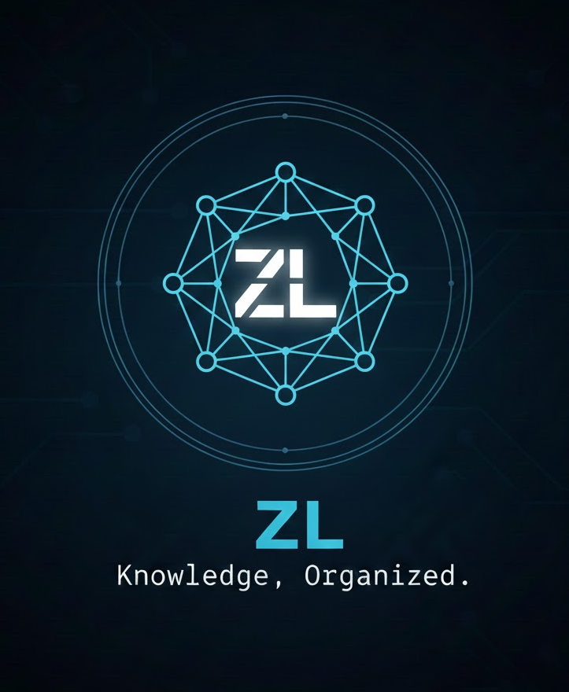

Status: WIP. API/UX unstable. Expect breaking changes.

A minimal, still-in-progress Zettelkasten CLI. Docs/features incomplete.

## Quick Start
- Requires Rust (edition 2024) and `cargo`
- Build: `cargo build --release`
- Run: `cargo run -- --help`

## Contributing
- Issues/PRs welcome
- Keep changes small, focused
- Be concise in discussions
